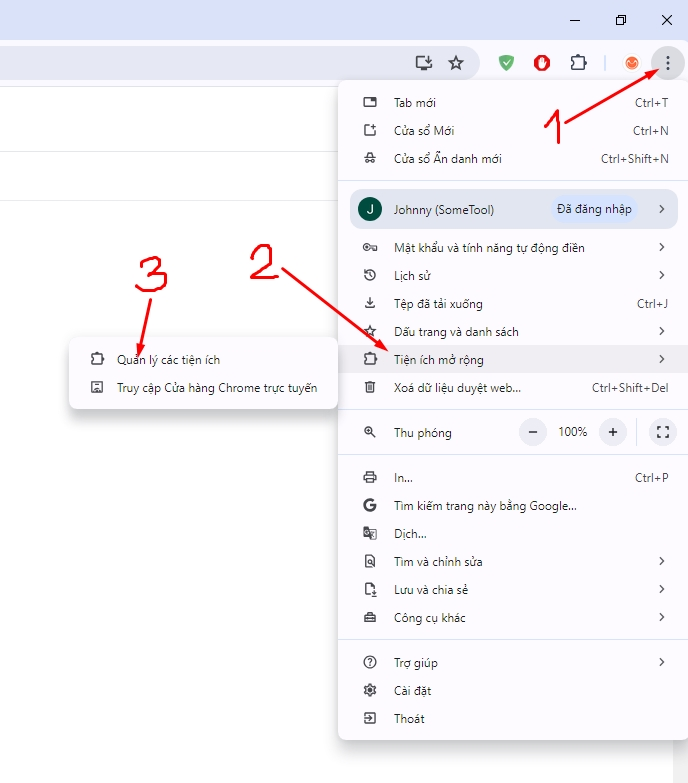
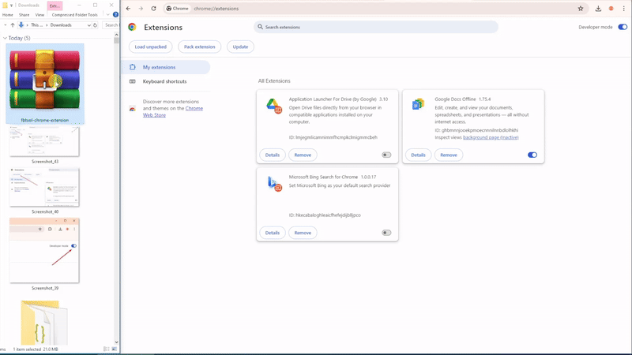
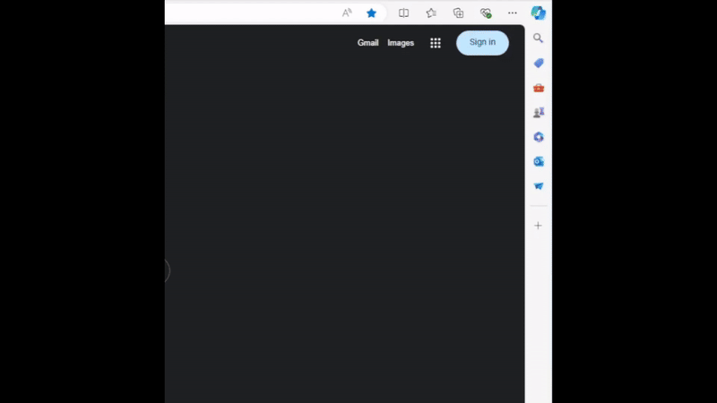
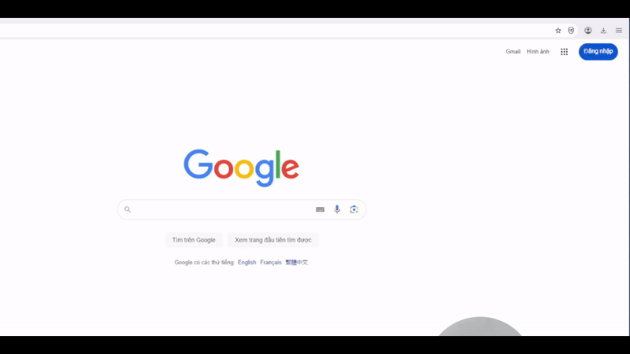

---
layout:
  title:
    visible: true
  description:
    visible: false
  tableOfContents:
    visible: true
  outline:
    visible: true
  pagination:
    visible: true
---

# ⬇️ Hướng Dẫn Sử Dụng

#### Để bắt đầu sử dụng, bạn cần đăng ký/đăng nhập, sau đó cài Tiện ích mở rộng vào trình duyệt (chỉ cần cài 1 lần), cụ thể:&#x20;

### Bước 1 - Đăng ký / Đăng nhập

Truy cập [**mailingtool.net**](https://mailingtool.net/) , ở góc trên bên phải nhấn chọn nút này và đăng ký/đăng nhập với tài khoản Google.

<figure><figcaption></figcaption></figure>

### Bước 2 - Tải và cài đặt Tiện ích mở rộng

A. Nhấn để tải **Tiện ích mở rộng** ở nút này

<figure><figcaption></figcaption></figure>

B. Trên trình duyệt Chrome, ở góc trên bên phải chọn dấu 1. Dấu ba chấm -> 2. Tiện ích mở rộng -> **3.** Quản lý các tiện ích

<figure><figcaption></figcaption></figure>

C. Bật **Chế độ cho nhà phát triển** ở góc trên bên phải

<figure><figcaption></figcaption></figure>

D. **Kéo và thả** file vừa tải vào giữa như ảnh phía dưới (Hoặc có thể giải nén file vừa tải, click chọn Tải tiện ích đã giải nén -> chọn file đã giải nén). Lưu ý: Khi cài bạn có thể sẽ thấy tiện ích báo <mark style="color:red;">lỗi màu đỏ</mark>, bạn **không cần quan tâm** lỗi này mà hãy thực hiện bước tiếp theo.

<figure><figcaption></figcaption></figure>



<figure><figcaption></figcaption></figure>



<figure><figcaption></figcaption></figure>



### Bước 3 - Kết nối và sử dụng

1. Mở một thẻ mới cho gmail.
2.  Qua thẻ gmail, làm mới trang (F5), tool sẽ tự động nhận. Có thể tắt thẻ facebook đi trong quá trình sử dụng. Nếu bạn muốn sử dụng nhiều tài khoản gmail thì hãy đăng nhập cùng 1 Chrome Profile hiện tại.

    <figure><figcaption></figcaption></figure>
3. Khi trang mailingtool đã Tải lại xong (trong vòng 5-15s), giao diện sẽ hiển thị danh sách các Địa chỉ Hộp thư, bạn hãy thử gửi 1 email đi để kiểm tra. Nếu gửi không thành công, thực hiện bước reset tool như sau:&#x20;
   1. tắt hết thẻ gmail đi
   2. bấm F5 chờ mailingtool được làm mới xong và thử lại

<figure><figcaption></figcaption></figure>

### Clip hướng dẫn (cập nhật sau)
