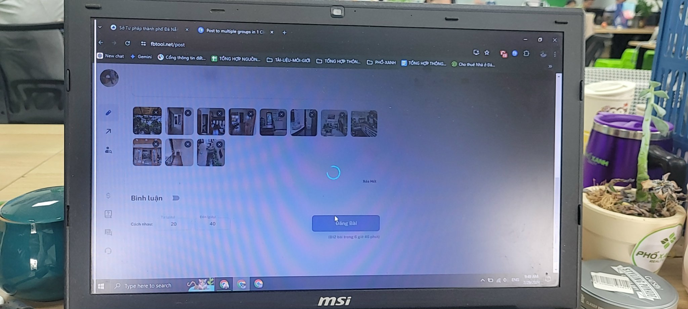
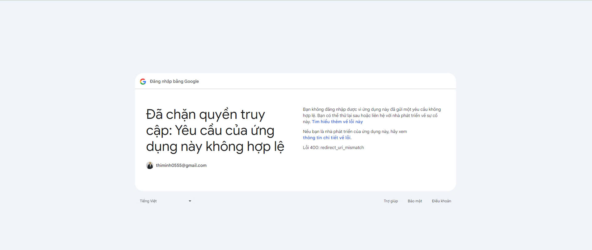
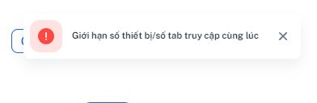
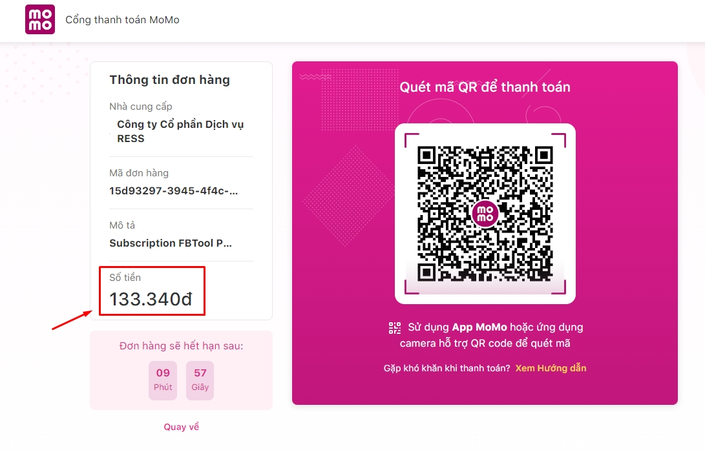

# ❓ Câu Hỏi Thường Gặp

### **Hỏi: Đã đăng nhập và cài Tiện ích mở rộng nhưng tool không nhận ra** Hộp thư của tôi **?**

Trả lời: Hãy kiểm tra thẻ Gmail của bạn, F5 Refresh nếu cần thiết rồi F5 Refresh thẻ MailingTool

### **Hỏi: Tool quay tròn và đứng không chạy nữa?**

<figure><figcaption></figcaption></figure>

Trả lời: Nếu bạn gặp hình trên, thì đã có vấn đề xảy ra giữa kết nối giữa trình duyệt của bạn và máy chủ (rớt mạng giữa chừng, phiên đăng nhập hết hạn, sử dụng proxy hoặc VPN,...). Bạn hãy đảm bảo và thử các bước sau:

* F5 làm mới trang
* Đăng xuất rồi đăng nhập lại
* Tắt VPN hoặc Proxy nếu đang sử dụng

### **Hỏi: Đăng nhập Google không thành công, trang không hiển thị giao diện tool?**

<figure><figcaption></figcaption></figure>

Trả lời: Nếu bạn gặp hình trên, thì có nghĩa trình duyệt của bạn thiếu một số dữ liệu của tool trước khi đăng nhập Google. Bạn hãy thao tác như sau:

* Vào đường dẫn chính xác [https://toptoptool.net/](https://toptoptool.net/)
* Bấm tổ hợp Ctrl/Cmd+Shift+R để tải lại trang tool
* Tiến hành đăng nhập lại

### **Hỏi: Vì sao tool đăng nhưng bài không lên, tool hiện 0 0 0 0...**

Trả lời:

Hãy đảm bảo rằng bạn chỉ cài một phiên bản Tiện ích mở rộng.

Hoặc có thể trình duyệt Chrome cho "ngủ" thẻ MailingTool do treo quá lâu. Bạn có thể làm như sau để thẻ MailingTool luôn "thức":

Chọn dấu 3 chấm góc trên bên phải của trình duyệt -> Cài đặt -> Hiệu suất -> thêm toptoptool.net

<figure><figcaption></figcaption></figure>

### Hỏi: Có bị mất tài khoản GMail không?

Trả lời: Không

### Hỏi: Email đăng ký MailingTool phải là email dùng để gửi thư?

Trả lời: email đăng ký MailingTool sẽ được tính là 1 Hộp thư theo gói sử dụng của bạn

### Hỏi: Một ngày gửi được bao nhiêu email? Từ bao nhiêu Hộp thư?

Trả lời: Mỗi Hộp thư GMail giới hạn gửi đi 500 email mỗi ngày. Đây là giới hạn của Google, không phải của MailingTool. Tuỳ vào gói sử dụng bạn sẽ được giới hạn nhân lên tương ứng bấy nhiêu Hộp thư. Tool sẽ tự động đổi qua Hộp thư kế tiếp để sử dụng.

### Hỏi: Tắt máy tool có chạy không?

Trả lời: Không

### Hỏi: Sleep máy tool có chạy không?

Trả lời: Không

### Hỏi: Đang đăng mà chuyển sang app khác trên điện thoại thì tool có chạy không?

Trả lời: Không

### Hỏi: Có phải tải xuống rồi cài đặt tool như các phần mềm khác không?

Trả lời: Không, tool chạy trên trình duyệt web.

### Hỏi: Tool hiện lên bảng giới hạn số thiết bị/số tab cùng lúc

Trả lời: Với 1 tài khoản MailingTool bạn có thể dùng với không giới hạn tài khoản Facebook, nhưng không thể dùng cùng lúc.

<figure><figcaption></figcaption></figure>

### Hỏi: 1 tài khoản MailingTool có thể dùng cùng lúc cho nhiều Hộp thư trên nhiều thiết bị không?

Trả lời: Không thể, nếu bạn muốn dùng cùng lúc thì phải mua nhiều tài khoản MailingTool. Ví dụ:

* Tk MailingTool A dùng trên PC cho Hộp thư A
* Tk MailingTool B dùng trên điện thoại cho Hộp thư B

### Hỏi: Tiện ích mở rộng có lỗi ?

Trả lời: Nếu bạn gặp tình trạng như hình dưới đấy thì -> Không sao cả, nút đó có tên là Lỗi, tool vẫn chạy bình thường bạn nhé.

<figure><figcaption></figcaption></figure>

### Hỏi: Lỡ mua gói thấp có nâng cấp lên gói cao hơn được không ? Có phải đợi cho hết thời gian gói cũ không?

Trả lời: Bạn có thể nâng cấp lên gói cao hơn bất kỳ lúc nào bạn muốn. 1ManBiz sẽ bớt đi những ngày bạn chưa dùng ở gói cũ, ví dụ:

Bạn đang dùng gói Basic tháng và còn 19 ngày, bạn muốn nâng cấp lên gói Pro tháng, thì bạn sẽ chỉ phải thanh toán 200.000 - (100.000 / 30 x 20) = **133.340 đ**

<figure><figcaption></figcaption></figure>

Lưu ý:

* Trong khi sử dụng sẽ không thể hạ xuống gói thấp hơn. Bạn cần sử dụng hết thời gian gói cao để mua gói thấp hơn.
* Nâng cấp gói không áp dụng khi bạn mua gói giống nhau. Ví dụ: bạn đang dùng gói Basic tháng còn 15 ngày, bạn mua thêm gói Basic 1 năm thì bạn sẽ trả 600k, hệ thống sẽ + 360 ngày, và số ngày hiển thị trên tool là 375 ngày.

### Hỏi: Có dùng được trên điện thoại iPhone hay iPad không?

Trả lời: Không
