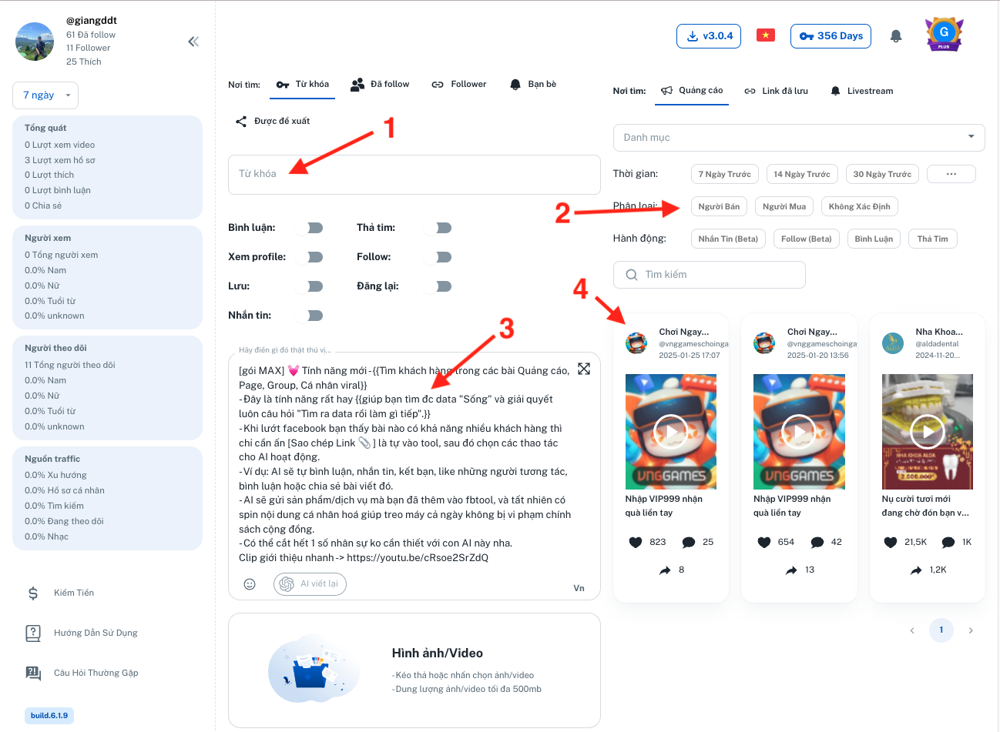
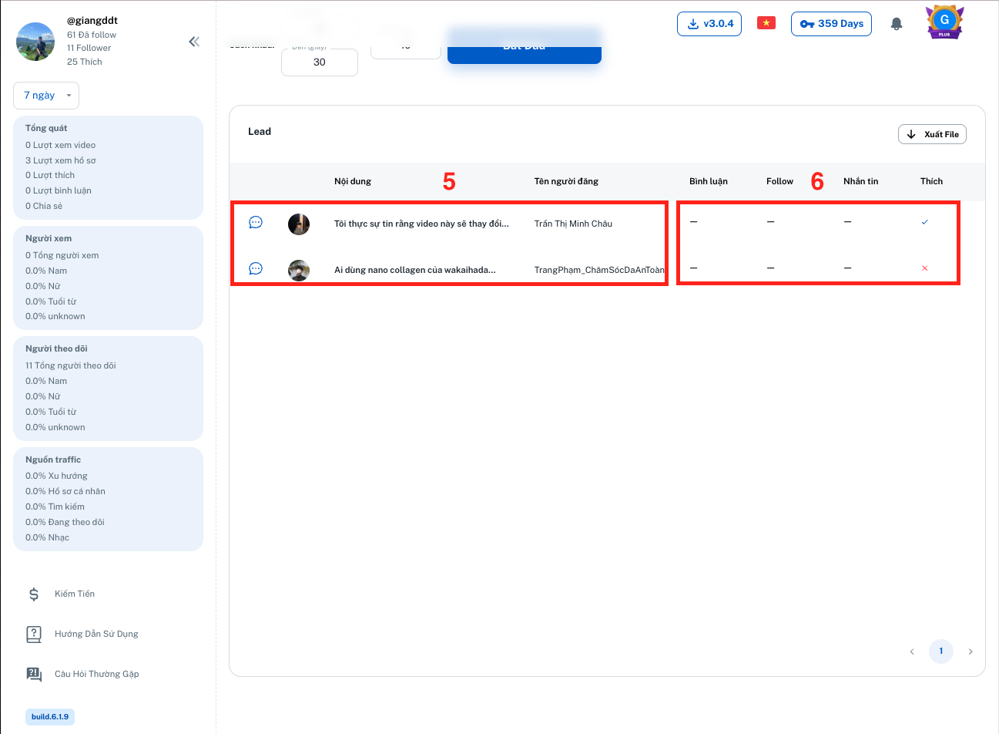

---
layout:
  title:
    visible: true
  description:
    visible: false
  tableOfContents:
    visible: true
  outline:
    visible: true
  pagination:
    visible: true
---

# 2️⃣ Gói PLUS

Với vị thế số 1 về tốc độ viral của Tiktok thì các tính năng của gói PLUS là một giải pháp hiệu quả nhất để giúp bạn có thể tăng doanh số.&#x20;

Khi bạn sử dụng gói PLUS, bạn được dùng tất cả các tính năng của gói thấp hơn là BASIC.

AI trong gói PLUS có thể giúp bạn tìm kiếm khách hàng tiềm năng tự động ở 3 nơi:  Tìm từ các bài **Quảng cáo**, các bài bạn **Yêu** **Thích**, các **Từ khóa phù hợp**

### 1. Tìm từ các bài <mark style="color:red;">Quảng cáo</mark>

1 - Bạn có thể tìm ra bài quảng cáo phù hợp theo Từ khoá.

Sau đó click chọn quảng cáo phù hợp (có thể chọn nhiều)

2 - Chọn đối tượng và Hành động: Bạn chọn đối tượng nào thì AI sẽ dùng tài khoản Tiktok của bạn để tương tác với hành động tương ứng

3 -  Thông tin sản phẩm/dịch vụ của bạn (cần thiết để bình luận và gửi tin nhắn)

4 - Danh sách quảng cáo

<figure><figcaption></figcaption></figure>

5 - AI cào thông tin các tương tác trong các quảng cáo (4) đã chọn

6 - AI tự động dùng tài khoản của bạn để thực hiện các hành động (2) với đối tượng (2) bạn đã chọn

<figure><figcaption></figcaption></figure>

### 2. Tìm từ các bài bạn <mark style="color:red;">Yêu</mark> <mark style="color:red;">Thích</mark>

<figure><figcaption></figcaption></figure>

Hoạt động tương tự như Quảng cáo, bạn có thể copy link bất kỳ bài viết nào bạn thích trên Tiktok, cách làm như sau:&#x20;

Nhấn chọn nút "Sao chép" (từ nút Chia sẻ/Share) các clip hoặc kênh bất kỳ.&#x20;

<figure><figcaption></figcaption></figure>

Nếu giao diện Facebook bạn không có nút "Sao chép", ấn nút "Chia sẻ" -> "Sao chép liên kết"

Nhấn Cho phép (chỉ cần làm 1 lần)

<figure><figcaption></figcaption></figure>

Chuyển qua thẻ Fbtool bạn sẽ thấy bài viết vừa mới sao chép

<figure><figcaption></figcaption></figure>

### 3. Tìm từ các <mark style="color:red;">Hội nhóm công khai và riêng tư</mark>

<figure><figcaption></figcaption></figure>

1. Ô điền từ khóa
2. Các group bạn đã tham gia
3. Chọn người bán, người mua hoặc không xác định (có thể chọn nhiều hoặc không chọn)
4. Khi tìm ra thì làm gì? Bình luận, nhắn tin hoặc kết bạn? (có thể chọn nhiều hoặc không chọn)
5. Kho sản phẩm của bạn, thông tin sản phẩm và hình ảnh
6. Phễu báo cáo

#### Logic của AI

#### **Logic của phần 1 và 2:**

Ở phần 1 - Từ khóa, nếu bạn không chọn nhóm nào, AI sẽ tìm các bài viết có từ khóa bạn điền trên toàn bộ Facebook như hình dưới (tìm luôn trong các nhóm bạn chưa tham gia). Bạn thấy gì thì AI thấy đó.

<figure><figcaption></figcaption></figure>

Ở phần 2 - Các nhóm bạn đã tham gia, nếu bạn chọn nhóm, AI sẽ tìm các bài viết có từ khóa chỉ ở trong nhóm đó như hình dưới. Bạn thấy gì thì AI thấy đó.

<figure><figcaption></figcaption></figure>

#### **Logic của phần 3 và 4:**

Ở phần 3 - Phân loại, ví dụ từ khóa bạn điền là "Phòng trọ Tân Bình" thì:

* Người mua là người có nhu cầu sử dụng, có nhu cầu thuê
* Người bán là người có phòng trọ cho thuê
* Không xác định là không liên quan đến mua hay bán hoặc viết tắt AI ko hiểu

Tùy theo nhu cầu và sản phẩm của bạn, bạn nhấn chọn Người bán/Người mua/Không xác định.

Ví dụ: Fbtool bán công cụ marketing trên Facebook thì sẽ chọn "Người bán"

Ở phần 4 - Hành động, nút "Bình luận" có 3 chế độ

* Không chọn -> AI sẽ ko bình luận
* Ấn 1 lần, nút bình luận màu xanh -> AI sẽ bình luận chào hỏi, nhắc lại nhu cầu, mời check inb hoặc kết bạn gửi thêm thông tin
* Ấn 2 lần, nút bình luận màu đỏ -> AI sẽ bình luận chào hỏi, nhắc lại nhu cầu, và copy paste toàn bộ nội dung sản phẩm.

<figure><figcaption></figcaption></figure>

#### **Logic của phần 5:**

AI sẽ đọc toàn bộ 10 sản phẩm của bạn và nhu cầu của "Người mua" để tìm ra sản phần phù hợp nhất theo thứ tự:

Giá -> Vị trí -> Loại sản phẩm

Ví dụ: Bạn có phòng trọ 4tr và phòng trọ 10tr. Nhu cầu của "Người mua" là phòng 3tr. AI sẽ gửi phòng 4tr

1. Từ khoá tìm kiếm nội dung quảng cáo
2. Lọc tìm nội dung quảng cáo theo Danh mục, Thời gian. Chọn người bán, người mua hoặc không xác định (có thể chọn nhiều hoặc không chọn). Khi tìm ra thì làm gì? Bình luận, nhắn tin hoặc kết bạn? (có thể chọn nhiều hoặc không chọn).
3. Thông tin sản phẩm hoặc dịch vụ của bạn cung cấp: cần thiết để hành động Bình luận, Gửi tin nhắn (đối với Trang cá nhân)
4. Ảnh đi kèm Bình luận và Tin nhắn
5. Danh sách quảng cáo hệ thống đã thu thập
6. Phễu báo cáo

### Lưu ý:

1 - Luôn để ít nhất 1 thẻ Facebook trong khi chạy gói MAX (Phần mềm sẽ tự mở 1 thẻ Facebook khi thực hiện nhắn tin, nếu bạn tắt thẻ này thì sẽ không thể thực hiện)

2 - Trong lúc tool chạy, bạn có thể dùng tài khoản này trên các thiết bị khác

3 - Theo quy định của Facebook, chỉ được gửi \~ 20 tin nhắn cho người lạ/ngày (Phần mềm sẽ tự dừng khi đạt giới hạn)

4 -  Vì sao AI tìm ra những bài viết không liên quan đến từ khóa tôi đưa vào?

Cùng 1 từ khóa, tất cả những kết quả bạn search trên Facebook đều giống với kết quả trong tool, bao gồm cả những kết quả không liên quan lắm như ví dụ dưới đây:

Từ khóa tìm kiếm "Phòng trọ Hà Nội"

<figure><figcaption></figcaption></figure>

Hiện AI trong gói Max đủ thông minh để phân loại những bài viết này là "Không xác định" và sẽ bỏ qua.

